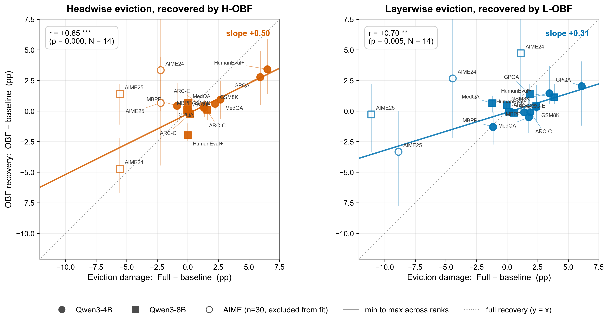
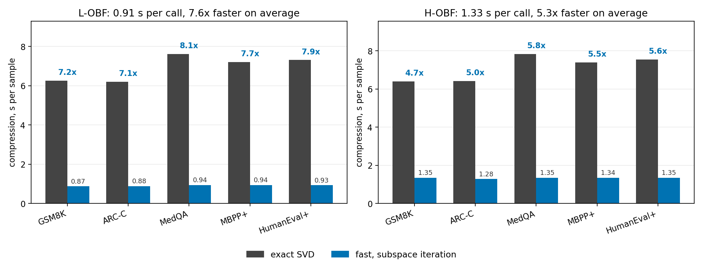
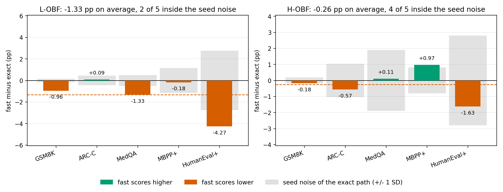
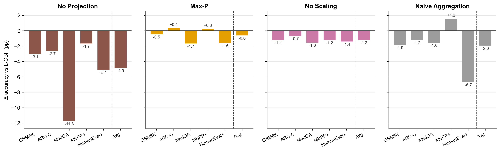
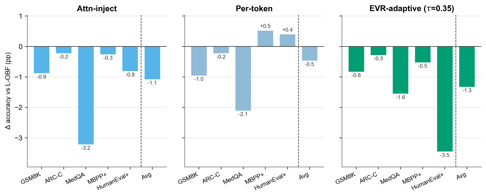

<a name="readme-top"></a>

# When Less Latent Leads to Better Relay: Information-Preserving Compression for Latent Multi-Agent LLM Collaboration

[](https://arxiv.org/abs/2604.13349)

```bibtex
@article{li2026when,
  title={When Less Latent Leads to Better Relay: Information-Preserving Compression for Latent Multi-Agent LLM Collaboration},
  author={Li, Yiping and An, Zhiyu and Du, Wan},
  journal={arXiv preprint arXiv:2604.13349},
  year={2026}
}
```

## 🔥 Updates

**2026-08, code release for v3.**

- **Fast SVD path** (`lobf_fast` / `hobf_fast`). Gram-matrix subspace iteration
  replaces the full decomposition and never forms the factorization. The
  compression step drops 7.6x for L-OBF and 5.5x for H-OBF, taking end-to-end
  cost from about 1.28x Full down to 1.05x. This is now the default path.
- **External KV-compression baselines.** int8 and int4 quantization of the full
  relay, quantized L-OBF, and a cache-merging adaptation, all compared at
  matched relay bytes. L-OBF composed with int8 reaches 9.0x compression while
  staying above plain eviction at 4.6x.
- **Alternative OBF designs.** Attention-weighted injection, per-token
  residuals, and EVR-adaptive rank, alongside component ablations that remove
  one internal step at a time. Nothing beats complete OBF at the same budget,
  and dropping the orthogonal projection costs 4.86 pp.
- **When OBF helps.** OBF's recovery tracks the eviction damage it undoes,
  r = 0.85 headwise and r = 0.70 layerwise over 14 model-benchmark cells with
  no rank selected. That turns the decision to use it into one dev-set probe.
- **Qwen3-14B**, partial.

**2026-07-01, arXiv v2.**

- Every Qwen3-4B experiment re-run on a single A100 configuration. Mixing GPU
  types moves accuracy by about the size of the effects being measured, so a
  table drawn from more than one card cannot separate a method difference from
  a placement difference.
- **Qwen3-8B** added on the same protocol, three seeds, all nine benchmarks.

**2026-04-14, arXiv v1.**

In LatentMAS, agents relay transformer KV caches instead of natural-language
messages. That preserves richer internal state and makes inter-agent
communication memory- and bandwidth-heavy. This repository adapts eviction-style
KV compression to the relay setting and adds **OrthoBackfill (OBF)**, a
value-only correction that reinjects the part of the discarded cache the
retained states cannot represent.

Two results drive the paper. Under a fixed relay budget, compressed relay stays
close to full KV relay at about a fifth of the bytes. And OBF's benefit is
predictable rather than incidental: it recovers a share of whatever the eviction
step destroyed, so it helps where the selector is lossy and does nothing where
it is not.

The maintained execution path is `--method latent_mas` with `--prompt sequential`.
`baseline` and `text_mas` are in [methods](./methods) for reference and are not
currently supported.

---

## 📊 Main results

Qwen3-4B, three seeds on A100, `kv_budget = 32` prompt states per agent round.
`L` is the total relayed prompt length summed across agents; `ρ` is the fraction
of prompt KV retained at the end of a rollout.

| Method | GSM8K | AIME24 | AIME25 | GPQA | MedQA | ARC-E | ARC-C | MBPP+ | HEval+ |
|---|---|---|---|---|---|---|---|---|---|
| *L* / *ρ* (%) | 524 / 19.1 | 663 / 15.1 | 819 / 12.2 | 942 / 10.6 | 1012 / 9.9 | 496 / 20.2 | 524 / 19.1 | 778 / 12.8 | 828 / 12.1 |
| Full | **88.98** | 48.89 | 43.33 | **39.26** | **61.67** | **91.98** | **87.03** | 58.20 | 68.90 |
| L | 86.58 | **53.33** | **52.22** | 33.16 | 59.89 | 90.59 | 85.13 | 59.35 | 65.45 |
| L-OBF | 87.74 | 52.22 | 45.56 | 31.98 | 61.56 | 90.24 | 85.30 | 59.26 | **69.11** |
| H | 86.76 | 51.11 | 45.56 | 33.33 | 59.00 | 90.64 | 85.69 | 59.08 | 62.40 |
| H-OBF | 87.52 | 52.22 | 46.67 | 34.01 | 61.44 | 90.78 | 85.75 | 59.70 | 68.29 |
| Gen | 82.21 | **53.33** | 47.78 | 29.78 | 57.22 | 85.70 | 79.72 | **61.73** | 64.63 |

Each OBF variant is compared against its own eviction baseline at the same relay
budget, H-OBF against H and L-OBF against L.

- **H-OBF beats H on all nine benchmarks**, sign test *p* = 0.008.
- L-OBF beats L on four of nine.
- At least one OBF variant finishes top-two on eight of nine benchmarks.
- L-OBF is the outright winner on HumanEval+, above Full.

The asymmetry between the two selectors is not noise. Headwise eviction is the
more damaging of the two at 4B, costing 2.73 pp against Full on average, so
H-OBF has more to recover. Layerwise sits closer to Full and leaves less room.
The next section makes that quantitative.

Both AIME sets have 30 problems and per-seed swings reaching 20 pp. We read them
as inconclusive in either direction, including where they favour us.

## 🎯 When OBF helps

OBF restores accuracy in proportion to what eviction discarded. For each
(model, benchmark) pair and each selector:

```
damage   = Acc(Full) - Acc(baseline)
recovery = mean over r in {2,4,8,16,32} of Acc(OBF at rank r) - Acc(baseline)
```

Recovery averages over the whole rank sweep, so no rank is selected anywhere.
Fitting recovery on damage over the 4B and 8B cells, AIME excluded, N = 14 per
selector:

| Selector | Slope | Intercept | Pearson *r* | *p* |
|---|---|---|---|---|
| Headwise, H-OBF vs H | +0.50 | ≈ 0 | +0.85 | < 10⁻³ |
| Layerwise, L-OBF vs L | +0.31 | ≈ 0 | +0.70 | 0.005 |



Both intercepts are indistinguishable from zero, so where eviction costs nothing
OBF neither helps nor hurts. Headwise OBF returns roughly half of what headwise
eviction removes; layerwise OBF returns roughly a third.

That turns "should I use this" into one measurement you would make anyway.
Probe Full against eviction on a small dev set at your scale. If the gap is
large, add OBF at a small fixed rank. If it is near zero, plain eviction already
suffices.

## 📈 Larger backbones

**Qwen3-8B**, three seeds, same protocol.

| Method | GSM8K | AIME24 | AIME25 | GPQA | MedQA | ARC-E | ARC-C | MBPP+ | HEval+ |
|---|---|---|---|---|---|---|---|---|---|
| Full | 91.96 | 66.67 | 47.78 | **52.12** | 74.11 | **98.39** | **95.02** | **75.57** | **83.33** |
| L | 92.01 | 65.56 | **58.89** | 50.25 | 75.33 | 98.26 | 94.48 | 73.19 | 79.47 |
| L-OBF | **92.70** | 72.22 | **58.89** | 50.76 | **75.56** | 98.32 | 94.43 | 73.72 | 80.08 |
| H | 92.01 | 72.22 | 53.33 | 50.76 | 74.11 | 98.34 | 94.82 | 73.99 | **83.33** |
| H-OBF | 92.12 | 65.56 | 55.56 | 51.61 | 74.78 | 98.33 | 94.62 | 74.34 | 81.10 |
| Gen | 89.82 | **73.33** | **58.89** | 46.87 | 74.67 | 97.77 | 93.37 | 72.66 | 79.67 |

The pattern inverts, and the recovery law says why. At 8B the headwise selector
is nearly lossless, its gap to Full collapsing from 2.73 pp to 0.45, so H-OBF
has almost nothing to recover and goes near-neutral. The layerwise selector
still loses ground, and **L-OBF matches or beats it on eight of nine**. Scale
did not weaken OBF. It removed the damage OBF exists to undo, on one selector
and not the other.

**Qwen3-14B**, partial.

| Method | GPQA | HumanEval+ | ARC-E | ARC-C |
|---|---|---|---|---|
| Full | **59.39** | 86.59 | 98.70 | 95.65 |
| L | 58.38 | 84.15 | 98.61 | 95.65 |
| L-OBF | 54.82 | 85.37 | 98.57 | – |
| H | 54.82 | 84.15 | 98.65 | **95.82** |
| H-OBF | 56.85 | 86.59 | **98.74** | – |
| Gen | 53.81 | 83.54 | 98.11 | 94.54 |

Same shape. OBF is close to neutral on ARC-E and ARC-C, where eviction costs
little, and returns part of the gap on GPQA and HumanEval+, where it does not.

## ⏱️ Cost

Qwen3-4B, five benchmarks with three-seed coverage for every method. Relay is
the KV size transferred per non-judger agent.

| Method | Relay (MB) | Relay ratio | Compression (s) | Output tokens | End-to-end (s) | E2E ratio | Avg GPU (GB) |
|---|---|---|---|---|---|---|---|
| Full | 290.1 | 1.00x | 0.00 | 1149 | 24.67 | 1.00x | 13.0 |
| L | 62.4 | 4.65x | 0.05 | 1247 | **24.31** | **0.99x** | 12.0 |
| L-OBF (fast) | 62.4 | 4.65x | 0.91 | 1274 | 25.79 | 1.05x | **11.8** |
| H | 61.6 | 4.71x | 0.07 | 1245 | 24.85 | 1.01x | 12.0 |
| H-OBF (fast) | 61.4 | 4.72x | 1.30 | 1239 | 25.97 | 1.05x | 12.0 |
| Gen | **35.4** | **8.19x** | 0.00 | 1269 | 25.97 | 1.05x | 12.0 |

Eviction moves about 62 MB against Full's 290, a 4.7x reduction. Every
compressed method lands within 5% of Full's wall clock even after paying for
compression.

**Full is the fastest end-to-end here, and that is a property of the setting
rather than of the method.** All agents sit on one A100, so the relay is a
pointer pass and the 4.7x byte reduction is invisible in wall clock. On
lower-bandwidth or multi-node deployments that reduction is real time. This is
close to the least favourable setting in which the method could be measured.

### Fast SVD path

The injection uses the top *k* right singular vectors of the residual, with
*k* ≤ 32 while the residual has thousands of rows. Full SVD spends most of its
work on rows the algorithm never reads. Replacing it with Gram-matrix subspace
iteration, `C ← orth(C G)` with `G = RᵀR` for three iterations, never forms the
factorization.

| Method | Compression (s) | Speedup | End-to-end (s) | E2E ratio |
|---|---|---|---|---|
| Full | 0.00 | – | 24.67 | 1.00x |
| L-OBF (exact) | 6.93 | 1.0x | 31.46 | 1.28x |
| **L-OBF (fast)** | **0.91** | **7.6x** | **25.79** | **1.05x** |
| H-OBF (exact) | 7.14 | 1.0x | 31.78 | 1.29x |
| **H-OBF (fast)** | **1.30** | **5.5x** | **25.97** | **1.05x** |



The subspace-iteration output matches the exact singular vectors to about 1e-4
relative error. A perturbation that small cannot change an answer directly, but
at temperature 0.6 it can flip one sampled token and the continuation forks from
there, so accuracy is verified rather than inferred from numerical agreement.



For H-OBF the fast path shifts accuracy by −0.26 pp with four of five benchmarks
inside the exact path's own seed noise band. For L-OBF the shift is −1.33 pp and
sits almost entirely on HumanEval+ (−4.27 pp; the other four fall between −1.33
and +0.09). HumanEval+ has the longest generations, the smallest test set at 164
problems, and a pass@1 metric sensitive to single-token substitutions, all of
which amplify per-step drift. The fast path is the default and this residual is
flagged rather than smoothed over.

Verify the operator yourself:

```bash
python check_gram_equivalence.py --alt fast
```

## 🔬 Ablations

Qwen3-4B, five benchmarks, everything measured against complete L-OBF at the
same relay budget. Negative means the variant loses accuracy.

**Component ablations** remove one internal step.

| Variant | Avg Δ vs L-OBF (pp) |
|---|---|
| No Projection | −4.86 |
| Naive Aggregation | −1.96 |
| No Scaling | −1.22 |
| Max-P | −0.63 |



The orthogonal projection is the step the design rests on. Dropping it costs
4.86 pp, which is several times what the whole method gains over eviction.
Naive aggregation swings unpredictably across tasks, so unstructured averaging
cannot stand in for projection plus scaling. Max-P is mild by construction,
since setting the rank to its cap is a valid configuration rather than a
removed component.

**Alternative designs** replace one step with a different implementation of the
same intent.

| Variant | Avg Δ vs L-OBF (pp) |
|---|---|
| EVR-adaptive (τ = 0.35) | −1.33 |
| Attn-inject | −1.09 |
| Per-token | −0.48 |



Nothing improves on L-OBF at the same budget. Per-token residuals come closest
but need a separate residual stored per retained token. Attention-weighted
injection re-emphasizes content the retained states already carry. Adaptive rank
pulls in the noisier residual directions that low-rank truncation exists to drop.

## 🔀 Other KV compression families

Qwen3-4B, as a delta from uncompressed Full relay. Five benchmarks, one per
capability in the suite. *Worst* is each method's weakest benchmark.

| Method | Compression | MedQA | GSM8K | ARC-C | MBPP+ | HEval+ | Mean | Worst |
|---|---|---|---|---|---|---|---|---|
| Full (uncompressed) | 1.0x | – | – | – | – | – | – | – |
| Layerwise | 4.6x | −1.78 | −2.40 | −1.91 | +1.15 | −3.46 | −1.68 | −3.46 |
| **L-OBF (r=4)** | **4.6x** | −0.11 | −1.24 | −1.73 | +1.06 | **+0.20** | **−0.36** | **−1.73** |
| Cache merging | 4.6x | −2.89 | −1.72 | −2.10 | **+3.35** | −1.42 | −0.96 | −2.89 |
| Full + int8 | 1.9x | **+0.22** | −0.99 | **+0.80** | −1.85 | −2.44 | −0.85 | −2.44 |
| Full + int4 | 3.7x | −0.33 | **−0.48** | +0.09 | +0.18 | −6.71 | −1.45 | −6.71 |
| L-OBF + int8 | **9.0x** | −2.89 | −1.74 | −1.54 | +2.38 | −3.05 | −1.37 | −3.05 |

At the 4.6x budget L-OBF has the best mean, the mildest worst case and the
tightest spread. It is not best everywhere: int8 leads on ARC-C, cache merging
leads on MBPP+, and each drops sharply somewhere else, most visibly on
HumanEval+. Stacking int8 on L-OBF reaches 9.0x at a modest average loss, higher
than any single-family method here.

Quantization is a different resource, and more of it. It cuts bits per entry
rather than entries, so the entry count is unchanged and every decoding step
still attends over the full relayed length.

Cache merging is an adaptation in the spirit of CaM rather than a reproduction:
each evicted value routes to its most key-similar retained slot and is added in,
weighted by attention mass. Keys are unchanged and the retained set stays at *B*,
so it shares the 62.4 MB budget of the other selection-based rows.

## 🧠 Method

### From full relay to selective relay

Each agent inherits the previous agent's KV message and appends its own states,
so relay cost grows with interaction depth. The cache splits into a shared
attention sink, inherited message history, the current agent's prompt context,
and its latent reasoning states. Compression acts on the current agent's prompt
states; inherited relay memory passes forward untouched.


### Eviction baselines

- **Gen**: keep the global sink and newly generated reasoning states, in the
  spirit of StreamingLLM.
- **H / L**: keep prompt states with the highest attention mass, in the spirit
  of H2O. H ranks per head, so retained positions differ across heads and
  layers. L aggregates across heads within a layer, so a layer shares one
  retained set.

### OrthoBackfill

Hard eviction removes prompt-side information that is still useful downstream,
especially when it is spread across discarded states rather than tied to one
retained token. OBF:

1. splits prompt values into kept and discarded sets
2. projects discarded values onto the span of retained values
3. isolates the orthogonal residual the retained span cannot represent
4. compresses that residual in a low-rank principal subspace
5. injects the value-only correction back into retained prompt values

It does not try to reconstruct everything dropped. It backfills only the part of
the discarded signal that the retained-value span cannot already express.


Values only, never keys. An earlier version injected into keys and lost
accuracy: cached keys are post-RoPE, so a residual added to them rotates them
off their positional phase.

## ⚙️ Setup

```bash
conda create -n compressed_latentmas python=3.10 -y
conda activate compressed_latentmas
pip install -r requirements.txt
```

Optional cache location and logging:

```bash
export HF_HOME=/path/to/huggingface
pip install wandb
```

## 🚀 Quick start

Full relay, the accuracy reference:

```bash
python run.py --method latent_mas --prompt sequential \
  --model_name Qwen/Qwen3-4B --task gsm8k \
  --compressor full --latent_steps 40 --generate_bs 8 --max_samples 20
```

Eviction only:

```bash
python run.py --method latent_mas --prompt sequential \
  --model_name Qwen/Qwen3-4B --task gsm8k \
  --compressor headwise --kv_budget 32 \
  --latent_steps 40 --generate_bs 8 --max_samples 20
```

Eviction plus OBF, the deployable path:

```bash
python run.py --method latent_mas --prompt sequential \
  --model_name Qwen/Qwen3-4B --task gsm8k \
  --compressor hobf_fast --kv_budget 32 --pca_rank 2 \
  --latent_steps 40 --generate_bs 8 --max_samples 20
```

`run.sh` loops this over a list of tasks and compressors.

Flags that matter:

| Flag | Meaning |
|---|---|
| `--compressor` | relay operator applied at each agent boundary |
| `--kv_budget` | prompt states retained per agent, `32` in the paper |
| `--pca_rank` | OBF rank, `4` for L-OBF and `2` for H-OBF |
| `--latent_steps` | latent rollout steps per non-judger agent |
| `--inject_mode` | `uniform` (default) or `attn` |
| `--prompt` | `sequential` on the supported path |

## 🧩 Compressors

`--pca_rank` applies to the OBF variants and is ignored by the rest.

**Relay endpoints**

| Name | What it does |
|---|---|
| `full` | uncompressed relay, the accuracy reference |
| `gonly` | relay only the sink and newly generated states |

**Eviction baselines**, both at `--kv_budget` retained entries

| Name | What it does |
|---|---|
| `layerwise` | attention ranking aggregated across heads within a layer |
| `headwise` | attention ranking per head |

**OBF**

| Name | What it does |
|---|---|
| `lobf_fast` / `hobf_fast` | eviction plus orthogonal backfill, Gram subspace iteration. **Use these.** |
| `lobf` / `hobf` | the same operator by exact SVD, kept as the reference implementation |

**Other compression families**

| Name | What it does |
|---|---|
| `full_quant` | int8 or int4 quantization of the full relay, see `--quant_bits` |
| `lobf_quant` | L-OBF composed with quantization |
| `lmerge` | cache merging: each evicted value folds into its most key-similar retained slot |

**Ablations**

| Name | What it does |
|---|---|
| `lobf_no_proj` / `hobf_no_proj` | drop the orthogonal projection |
| `lobf_no_scale` / `hobf_no_scale` | drop the demand-aware scaling |
| `lobf_naive` / `hobf_naive` | average the deleted values directly, bypassing every step |
| `lobf_max_p` / `hobf_max_p` | use all residual components instead of a low-rank subspace |
| `lobf_per_token` | a separate residual direction per retained slot |
| `lobf_evr` | rank chosen by explained variance; `--pca_rank` is then the threshold in percent |
| `--inject_mode attn` | weight the injection by attention rather than spreading it uniformly |

`lobf_batched` and `lobf_gram` are development variants kept for the equivalence
tests and are not used in the paper.

## 🧪 Tasks

`gsm8k`, `aime2024`, `aime2025`, `gpqa`, `arc_easy`, `arc_challenge`,
`mbppplus`, `humanevalplus`, `medqa`.

## 📉 Reproducing the tables and figures

Runs log to Weights & Biases with `--use_wandb`. The scripts in
[analyze](./analyze) pull those summaries and regenerate what the paper prints.
Set your entity first:

```bash
export WANDB_ENTITY=your-entity
```

| Script | Output |
|---|---|
| `generate_latex_accuracy_table.py` | the main accuracy tables |
| `plot_gap_recovery.py` | damage against recovery, with the fitted slopes |
| `plot_fast_speedup.py` | fast against exact, compression time and accuracy |
| `plot_obf_design_ablation.py` | the two ablation figures |
| `plot_kv_compression_baselines.py` | the external-baseline comparison |
| `plot_budget_curve.py` | accuracy against `kv_budget` |
| `plot_pca_rank_sweep.py` | accuracy against `pca_rank` |
| `plot_time_tradeoff.py` | the cost breakdown |

## 📝 Output

Each run writes per-sample JSONL to `--output_folder`: prediction and gold
label, correctness, agent traces, relayed bytes, and runtime metrics.

## 📌 Notes

- The supported path is sequential LatentMAS under `--method latent_mas`.
- `baseline` and `text_mas` are present in [methods](./methods) and are not
  currently supported.
- Some legacy parser options remain in the tree; this README documents the
  actively supported path.
- OBF assumes grouped-query attention and touches only the KV cache, so the
  operator carries over to any dense GQA backbone. Whether the compression
  *behaviour* carries over to another model family is untested.
- Exact reproduction depends on model version, seed, and hardware. Accuracy is
  deterministic given a seed within one environment, and every number reported
  here comes from a single A100 configuration for that reason.

## 🙏 Acknowledgement

This codebase builds on LatentMAS and on prior work in long-context KV eviction,
cache compression, and efficient LLM inference.
